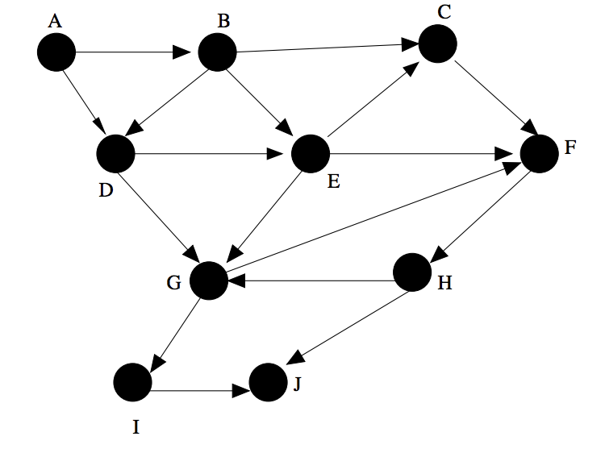

# DPUM - Session 03 - Problem Set

## 1. Simulating Graph Algorithms - The Algorithm Design Manual
----------------------------------------------------------------

A. Do a topological sort of the following graph *G*. (5-2)

## 2. Graph Traversal - The Algorithm Design Manual
----------------------------------------------------------------

A. Write a function to traverse binary search tree and return the *i*th node in sorted order (5-32)

B. An articulation vertex of a graph *G* is a vertex whose deletion disconnects *G*.
Let *G* be a graph with *n* vertices and *m* edges. Give a simple *O(n + m)* algorithm for finding a vertex of *G* that is not an articulation vertex — i.e., whose deletion does not disconnect *G*. (5-28)

## 3. Graph Traversal Applications - Programming Challenges -UVa
----------------------------------------------------------------

A. [10004 - Bicoloring](https://uva.onlinejudge.org/external/100/10004.pdf)

B. [10067 - Playing with Wheels](https://uva.onlinejudge.org/external/100/10067.pdf)

C. [10099 - The Tourist Guide](https://uva.onlinejudge.org/external/100/p10099.pdf)

D. [10029 - Edit Step Ladders](https://uva.onlinejudge.org/external/100/10029.pdf)

E. [10051 - Tower of Cubes](https://uva.onlinejudge.org/external/100/10051.pdf)
